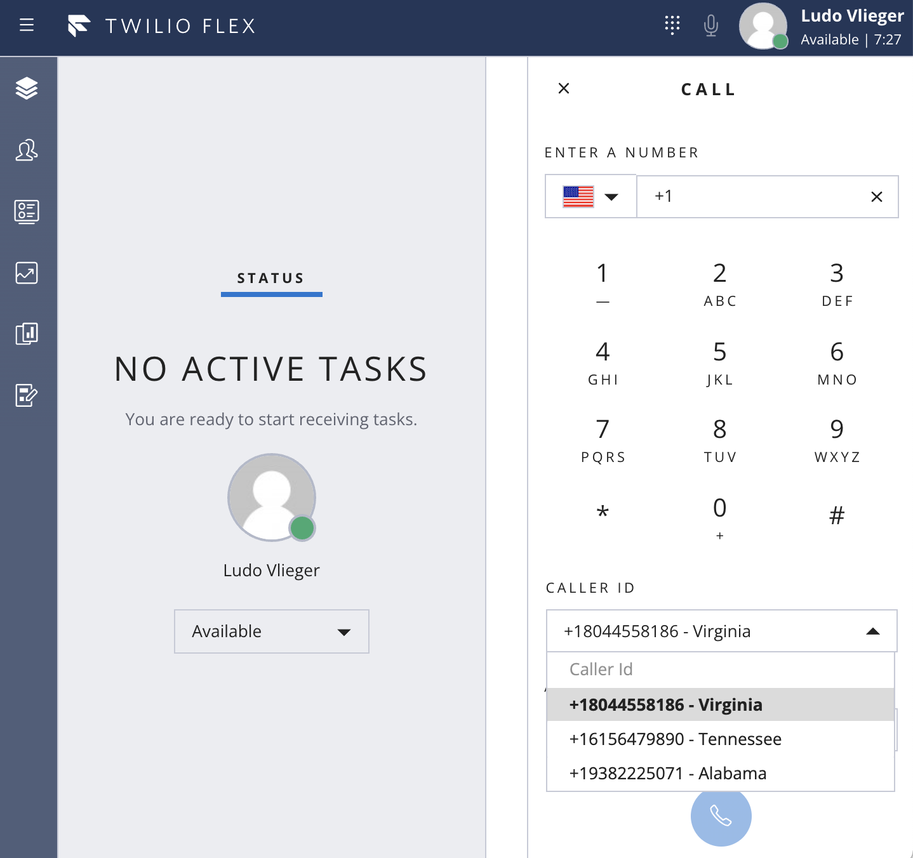

# Outbound Caller ID Plugin

Twilio Flex Plugins allow you to customize the appearance and behavior of [Twilio Flex](https://www.twilio.com/flex). If you want to learn more about the capabilities and how to use the API, check out our [Flex documentation](https://www.twilio.com/docs/flex).


## How it works
This Flex plugin add a Caller Id selection menu to the Dialpad to allow agents making outbound calls to pick the appropriate Outbound Caller Id for each call.

This plugin leverages a Twilio Function to read the list of caller Ids from an Json config file asset upon initialization. The array is stored in the application's Redux store.  

A [beforeStarOutboundCall](
https://assets.flex.twilio.com/docs/releases/flex-ui/1.27.0/Actions.html#.StartOutboundCall)
action listener is added to override the `payload.callerId` attribute with the selected caller Id.



Additionally this plugin includes functionality to play an announcement to both the customer and agent/worker that the Call May Be Recorded for Quality Purposes.  After the outbound call task reservation has been accepted by the worker, the plugin waits for the customer to join the conference before [updating the conference with the announceUrl](https://www.twilio.com/docs/voice/api/conference-resource?code-sample=code-update-a-conference-to-announce-something&code-language=Node.js&code-sdk-version=3.x)

# Configuration

## Requirements

To deploy this plugin, you will need:

- An active Twilio account with Flex provisioned. Refer to the [Flex Quickstart](https://www.twilio.com/docs/flex/quickstart/flex-basics#sign-up-for-or-sign-in-to-twilio-and-create-a-new-flex-project%22) to create one.
- npm version 5.0.0 or later installed (type `npm -v` in your terminal to check)
- Node.js version 12 or later installed (type `node -v` in your terminal to check). We recommend the _even_ versions of Node.
- [Twilio CLI](https://www.twilio.com/docs/twilio-cli/quickstart#install-twilio-cli) along with the [Flex CLI Plugin](https://www.twilio.com/docs/twilio-cli/plugins#available-plugins) and the [Serverless Plugin](https://www.twilio.com/docs/twilio-cli/plugins#available-plugins). Run the following commands to install them:

```
# Install the Twilio CLI
npm install twilio-cli -g
# Install the Serverless and Flex as Plugins
twilio plugins:install @twilio-labs/plugin-serverless
twilio plugins:install @twilio-labs/plugin-flex
```

## Setup

Install the dependencies by running `npm install`:

```bash
cd plugin-outbound-callerid
npm install
cd ../serverless
npm install
```
From the root directory, rename `public/appConfig.example.js` to `public/appConfig.js`.

```bash
mv public/appConfig.example.js public/appConfig.js
```

## Serverless Function and Asset

This plugin includes a Twilio function that reads a config file (Twilio Asset).  The config file (config.private.json) contains the list of Twilio phone numbers that the agent can select from.  Update this file to match your list of allowed (and provisioned) Twilio phone numbers associated with Flex (Inbound Studio IVR flows).

### Deployment

```bash
cd serverless
twilio serverless:deploy
```
After successfully deploying your function and asset (config file), you should see at least the following:
```bash
✔ Serverless project successfully deployed

Functions:
   https://config-functions-xxxx-dev.twil.io/get-asset-file
Assets:
   [private] Runtime.getAssets()['/config.json']
```

Your function will now be present in the Twilio Functions Console and be part of the "config-functions" service. Copy the base URL from the function.

## Flex Plugin

### Development

Create the plugin config file by copying `.env.example` to `.env`.

```bash
cd plugin-outbound-callerid
cp .env.example .env
```

Edit `.env` and set the `FLEX_APP_FUNCTIONS_BASE` variable to your Twilio Functions base URL (like https://config-functions-xxxx-dev.twil.io). 

To run the plugin locally, you can use the Twilio Flex CLI plugin. Using your command line, run the following from the root directory of the plugin.

```bash
cd plugin-outbound-callerid
twilio flex:plugins:start
```

This will automatically start up the webpack dev server and open the browser for you. Your app will run on `http://localhost:3000`.

When you make changes to your code, the browser window will be automatically refreshed.


### Deploy your Flex Plugin

Once you are happy with your Flex plugin, you have to deploy then release it on your Flex application.

Run the following command to start the deployment:

```bash
twilio flex:plugins:deploy --major --changelog "Releasing Outbound Caller Id plugin" --description "Outbound Caller Id plugin"
```

After running the suggested next step, navigate to the [Plugins Dashboard](https://flex.twilio.com/admin/) to review your recently deployed plugin and confirm that it’s enabled for your contact center.

**Note:** Common packages like `React`, `ReactDOM`, `Redux` and `ReactRedux` are not bundled with the build because they are treated as external dependencies so the plugin will depend on Flex to provide them globally.

You are all set to test this plugin on your Flex application!

## License

[MIT](http://www.opensource.org/licenses/mit-license.html)

## Disclaimer

No warranty expressed or implied. Software is as is.


